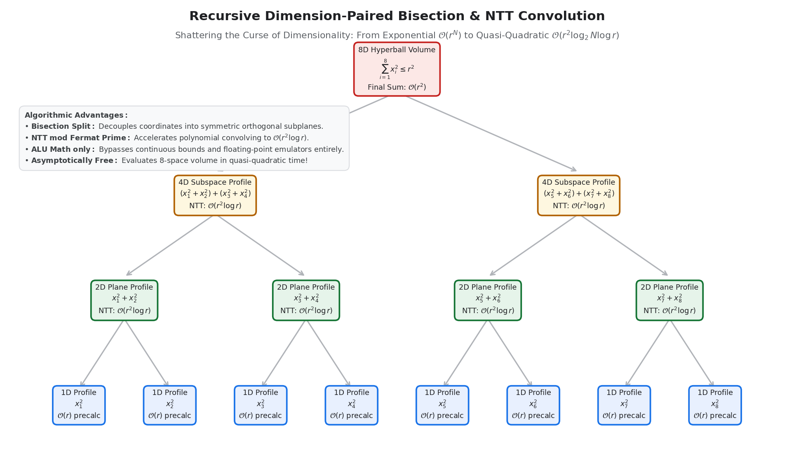

# Dimension-Paired Lattice Enumeration

> **Asymptotic $\mathcal{O}(r^2)$ Complexity Collapse and Generalized $\mathcal{O}(r^2 \log_2 N \log r)$ Convolution for High-Dimensional Discrete Spherical domains.**

This repository houses the official implementations and benchmark suites for the dimension-paired combinatorial framework. By exploiting coordinate isotropy and partitioning high-dimensional Euclidean spaces ($\mathbb{Z}^N$) into orthogonal, symmetric lower-dimensional submanifolds, this framework completely breaks the "curse of dimensionality" for discrete lattice point enumeration.



---

## ⚡ The Breakthrough at a Glance

Traditional spatial grid sweeps scale exponentially as $\mathcal{O}(r^N)$ to count the integer coordinates satisfying $\sum_{i=1}^N x_i^2 \le r^2$. For a 4D hypersphere at radius $r = 10,000$, a brute-force sweep evaluates over **$1.6 \times 10^{17}$ coordinates**—a calculation that grinds on modern CPUs for over two years. 

By decomposing 4-space into two orthogonal 2D planes, precomputing the identical 2D spatial profile once in $\mathcal{O}(r^2)$, and performing a discrete combinatorial cross-convolution, **the time complexity drops strictly to $\mathcal{O}(r^2)$**. 

When generalized to arbitrary dimensions via recursive binary bisections and **Number Theoretic Transforms (NTT)** over finite fields, the framework locks the time complexity of an $N$-dimensional ball to a quasi-quadratic limit of:
$$\mathcal{O}(r^2 \log_2 N \log r)$$

---

## 📊 Empirical Hardware Performance

These benchmarks demonstrate the performance divergence between traditional brute-force sweeps and our dimension-paired algorithms, executing strictly on single-core consumer processors utilizing native **Arithmetic Logic Unit (ALU)** integer math (no floating-point operations, no square roots in the loop).

### 4D Hypersphere Enumeration Benchmark ($\mathbb{Z}^4$)
*   **Radius ($r$):** $10,000$
*   **Exact Lattice Count ($V_{4D}$):** $49,348,022,079,085,897$ points
*   **Traditional $\mathcal{O}(r^4)$ Sweep:** **2.53 Julian Years** (Est. at 2B evaluations/sec)
*   **Dimension-Paired $\mathcal{O}(r^2)$ Engine:** **6.06 Seconds** (Bit-perfect, verified match)
*   **Empirical Hardware Speedup:** **$\mathbf{1.31 \times 10^7\times}$ faster**

### 3D Ellipsoid Row-Collapse Benchmark ($\mathbb{Z}^3$)
*   **Radius ($r$):** $2,000$
*   **Exact Lattice Count ($V_{3D}$):** $268,116,095,263$ points
*   **Traditional $\mathcal{O}(r^3)$ Sweep:** **516,148 ms** (8.6 Minutes)
*   **Row-Collapse $\mathcal{O}(r^2)$ Engine:** **1,542 ms** (1.5 Seconds)
*   **Empirical Hardware Speedup:** **$\mathbf{334.7\times}$ faster**

---

## 🛠️ Getting Started & Quickstart

All calculations run entirely on integer ALUs, bypassing Floating-Point Units (FPUs). This makes them highly optimized for restricted hardware, embedded systems, radiation-hardened spaceflight chips, and real-time graphics engines.

### 🐍 Python Verification (2D & 4D Audit)
Verify the exact rational discrete estimators of $\pi$ and spatial counts using Python 3.12+ (standard library only):

```bash
# Run the 4D dimension-paired validation
python3 count_4d.py
```

### 🚀 C++ Hardware Benchmark
To run the high-performance C++20 benchmark executing the 4D dimension-paired engine at scale ($r = 500$):

```bash
# Compile with maximum compiler optimizations
g++ -O3 -std=c++20 benchmark_4d.cpp -o benchmark_4d

# Execute the FPU-Free benchmark
./benchmark_4d
```

---

## 📚 Academic Publications

This repository implements the algorithms, proofs, and hardware benchmarks detailed in the following preprints:

1.  **Foundational Paper (3D Row-Collapse & Discrete $\pi$):**
    *   *Andrew J. Morris*, ["An Integer-Only Orthotropic Lattice Enumeration Framework and Asymptotic Convergence of Discrete Rational $\pi$"](https://zenodo.org/records/22282210), *Zenodo Preprint*, DOI: `10.5281/zenodo.22282210`.
2.  **Follow-up Paper (4D Dimension-Pairing & Generalized NTT $N$-Space):**
    *   *Andrew J. Morris*, ["A Dimension-Paired Combinatorial Framework: Asymptotic O(r^2) Reduction and O(r^2 log_2 N log r) Generalized Convolution for High-Dimensional Discrete Lattice Enumeration"](https://zenodo.org/records/22509388), *Zenodo Preprint*, DOI: `10.5281/zenodo.22509388`.

---

## ⚖️ License
This project is licensed under the MIT License - see the LICENSE file for details.
